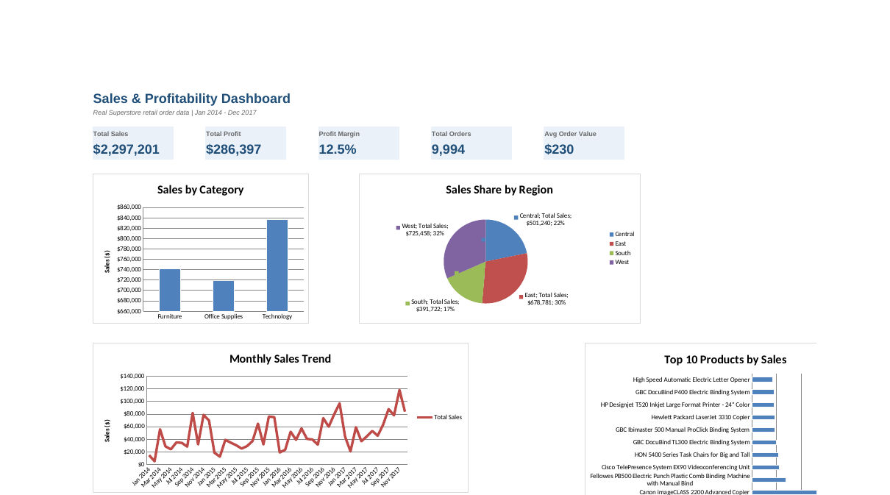

# Sales & Profitability Dashboard

An interactive, formula-driven Excel dashboard analyzing real retail sales and profitability across categories, regions, segments, and time.

## What this shows

- **KPI summary**: Total Sales, Total Profit, Profit Margin, Total Orders, Avg Order Value
- **Sales by Category** (bar chart)
- **Sales Share by Region** (pie chart)
- **Monthly Sales Trend**, Jan 2014–Dec 2017 (line chart)
- **Top 10 Products by Sales** (bar chart)
- **Segment-level breakdown** (Consumer / Corporate / Home Office)

## Data

Real order-level retail data — **9,994 line items, Jan 2014–Dec 2017** — from the widely-used "Sample Superstore" dataset (originally distributed with Tableau, and commonly used for analytics practice, e.g. on [Kaggle](https://www.kaggle.com/datasets/vivek468/superstore-dataset-final)). This copy was sourced from a public GitHub repository ([Slothcoder310/superstore-sales-analysis](https://github.com/Slothcoder310/superstore-sales-analysis)) hosting the same dataset.

Verified during cleaning: zero missing values, zero duplicate row IDs, consistent date formatting. Full source and cleaning notes are documented in the workbook's `Data Notes` tab.

## How it's built

- **100% formula-driven** — every KPI and chart pulls from `SUMIFS`/`COUNTIFS` formulas referencing a structured Excel Table (`RawData`), not hardcoded numbers. Change the underlying data and everything recalculates.
- **4 tabs**: `Dashboard` (visual summary), `Raw Data` (source table), `Analysis` (formula breakdowns by category/region/segment/month/product — ~3,900 formulas total), `Data Notes` (source & cleaning documentation)

## Key findings

- Furniture generates the 2nd-highest sales but the thinnest profit margin (~2.5%) of any category — heavy discounting on Tables and Bookcases is the likely driver.
- Technology carries the strongest margin (~17.4%) on sales volume comparable to Furniture.
- The West region leads in both total sales and total profit; Central trails on profit despite outselling South.
- Monthly sales show a clear seasonal spike each Q4 (Sep–Dec), consistent across all four years.

## Tools used

Microsoft Excel — formulas, structured Tables, native charts, conditional formatting.

## What I'd add next

- Slicers / PivotTable version for interactive filtering
- A Python (pandas) version of the same analysis for comparison
- Year-over-year growth breakdown

## Files

- `Sales_Profitability_Dashboard.xlsx` — the full workbook
